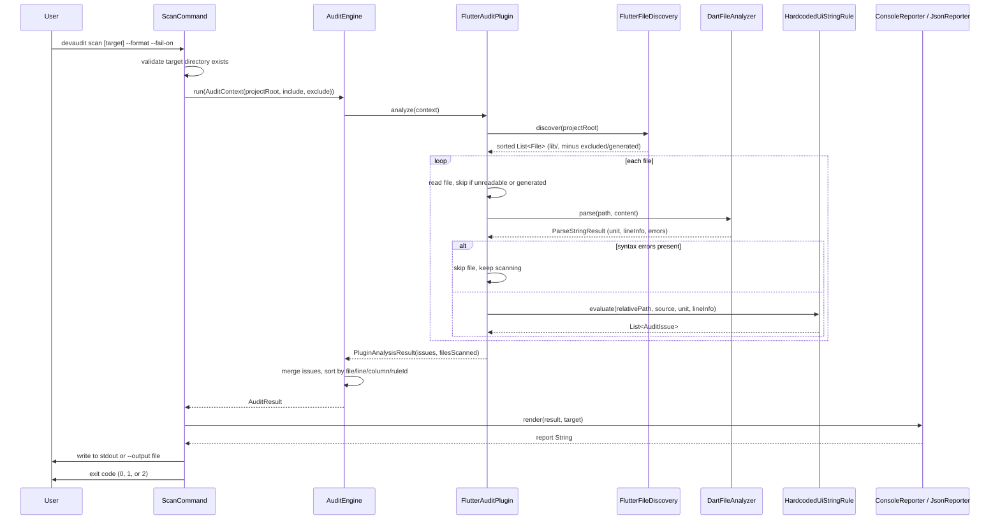

# Audit Flow

This is the sequence of a single `devaudit scan` run, from the CLI down to
the rendered report.

## Failure handling

- **A single file fails to parse or read**: the plugin skips it and keeps
  scanning the rest of the project. It is still counted in `filesScanned`
  once reading succeeds, even if parsing then fails.
- **A whole plugin throws**: `AuditEngine.run` catches the exception,
  records it in `AuditResult.pluginSummaries` (with `succeeded: false` and
  the error message), and continues with any remaining plugins. A plugin
  failure never aborts the audit or crashes the CLI.
- **Invalid CLI usage** (bad `--format` value, wrong number of arguments,
  missing target directory): the CLI returns exit code `2` with a short,
  human-readable message on stderr — never a raw stack trace.

## Determinism

`AuditEngine` sorts the combined issue list by file path, then line, then
column, then rule ID before returning it, regardless of plugin iteration
order or filesystem traversal order. Both reporters render from that same
sorted list, so console and JSON output are stable across repeated runs on
an unchanged project.
