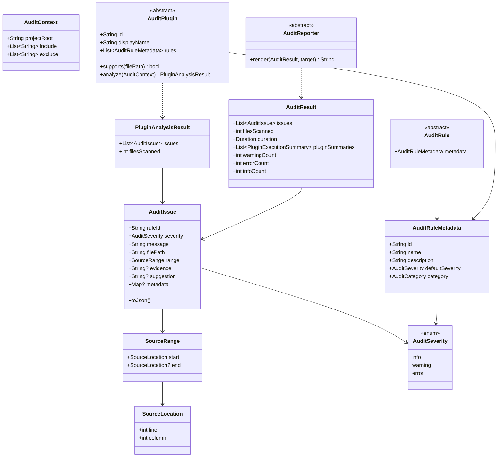

# Domain Model

All core types are immutable and live under `lib/core/model/`,
`lib/core/rule/`, and `lib/core/plugin/`. None of them know what Flutter,
Dart, or any other language is.

## Notable design decisions

- **`AuditCategory` is a value class, not an enum.** An enum would force
  every new plugin category (accessibility, performance, ...) to be added
  to core first. `AuditCategory` provides a handful of named constants
  (`AuditCategory.localization`, `.accessibility`, ...) but any plugin can
  construct `AuditCategory('something-new')` without touching core.
- **Rule IDs are the stable public identifier.** `AuditRuleMetadata`
  equality is defined on `id` alone; `AuditIssue` carries the rule ID
  directly (a `String`, not an `AuditRule` reference) so that serialized
  reports never depend on an in-memory rule registry.
- **`SourceRange.end` is optional.** Not every parser or heuristic can
  determine exactly where a finding ends. A `null` end means "unknown," not
  "zero-width."
- **`AuditRule` is metadata-only.** How a rule actually evaluates source
  code (an AST visitor, a regex, a token scanner) is plugin-specific and
  deliberately not part of the core contract — the engine never calls rule
  evaluation directly, only `AuditPlugin.analyze`.
- **Manual `==`/`hashCode`, no code generation.** Every model that needs
  value equality implements it by hand (using `package:collection`'s
  `DeepCollectionEquality` only where a `Map` field requires it). This
  keeps the package free of `build_runner` and generated `.g.dart` files.
