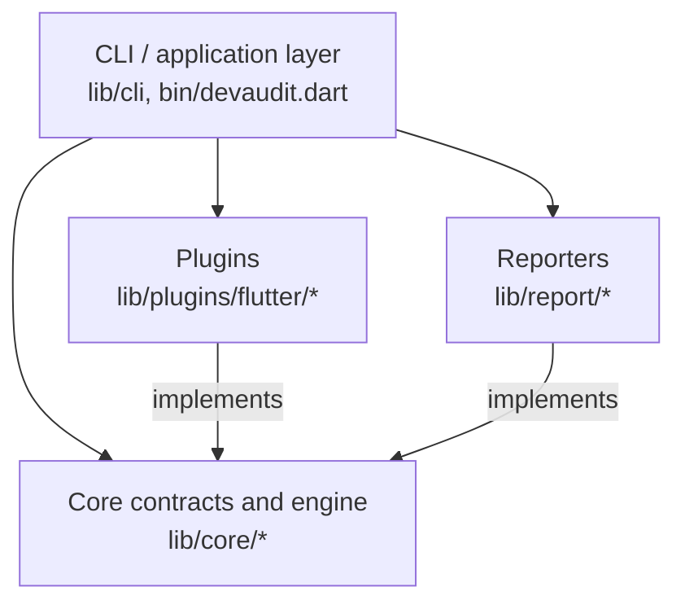

# Architecture Overview

DevAudit is split into three layers with a strict, one-directional
dependency rule:

- **Core** (`lib/core/`) defines the domain model and the contracts
  (`AuditPlugin`, `AuditRule`, `AuditReporter`) plus the `AuditEngine` that
  orchestrates a scan. It depends on nothing outside `package:meta` and
  `package:collection` (for value-type equality).
- **Plugins** (`lib/plugins/flutter/`) implement `AuditPlugin`. They own all
  language- and framework-specific logic: file discovery rules, parsing
  (`package:analyzer`), AST visitors, and rule evaluation. Core never
  imports a plugin; a plugin always imports core.
- **Reporters** (`lib/report/`) implement `AuditReporter`. They turn an
  `AuditResult` into a string. They perform no file I/O themselves.
- **CLI** (`lib/cli/`, `bin/devaudit.dart`) is the only layer that knows
  about `package:args`, wires a concrete list of plugins and reporters
  together, and performs file I/O (reading the target directory, writing
  `--output`).

## Why this shape

The [ADR](../adr/0001-plugin-based-architecture.md) that established this
split explains the reasoning in more detail. In short: DevAudit's stated
goal is to eventually audit multiple languages and frameworks. If
Flutter-specific logic leaked into the core, every future plugin (React,
Kotlin, Swift, ...) would have to route around it. Keeping the core
ecosystem-agnostic means a new plugin is purely additive — it never touches
`lib/core/`.

## What the core is not allowed to import

- `package:flutter` (or any Flutter-specific package)
- `package:analyzer`
- `package:args`
- `package:yaml`
- Any plugin (`lib/plugins/**`) or CLI (`lib/cli/**`) code
- `dart:io`, outside of what a domain model unavoidably needs (in practice:
  none of the current core models need it)

## How a scan runs

See [audit-flow.md](audit-flow.md) for the full sequence, and
[domain-model.md](domain-model.md) for what each core type represents.
